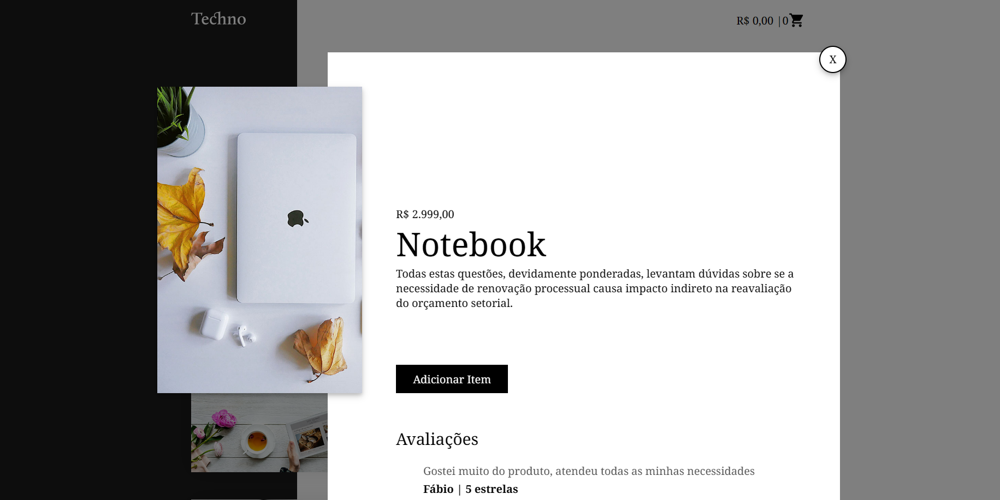
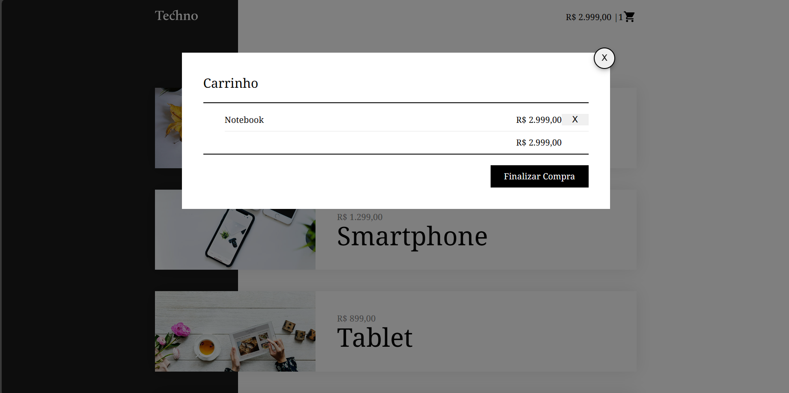
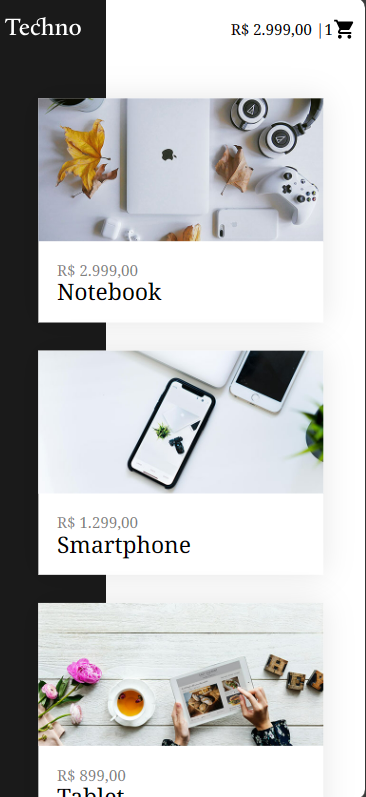
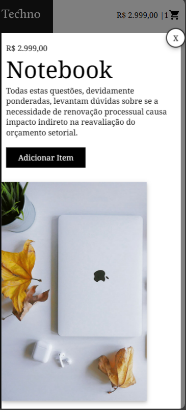
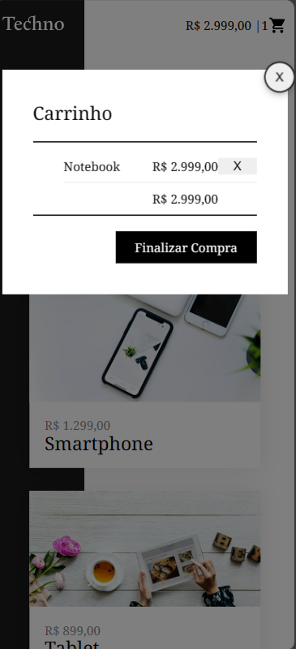

# Tecno-api


This is a solution for the Tecno project using Origamid's Composition API course. (https://www.origamid.com/curso/vue-js-completo).


## Table of contents

- [Overview](#overview)
  - [The challenge](#the-challenge)
  - [Recommended IDE Setup](#recommended-ide-setup)
  - [Screenshot](#screenshot)
  - [Links](#links)
- [My process](#my-process)
  - [Built with](#built-with)
  - [What I learned](#what-i-learned)
- [Author](#author)
- [Acknowledgments](#acknowledgments)

## Overview

### The challenge

Users should be able to:

- View the optimal layout for the site depending on their device's screen size
- Click on the product and open a modal with more information about the selected product
- Add the item to the cart
- Show in the header the total value and total quantity of products that are in the affection
- Click on the cart icon will open a modal with the selected products and the total value of all products

### Recommended IDE Setup

[VSCode](https://code.visualstudio.com/) + [Volar](https://marketplace.visualstudio.com/items?itemName=Vue.volar) (and disable Vetur).

## Customize configuration

See [Vite Configuration Reference](https://vitejs.dev/config/).

## Project Setup

```sh
npm install
```

### Compile and Hot-Reload for Development

```sh
npm run dev
```

### Compile and Minify for Production

```sh
npm run build
```

## Screenshot

Desktop


Desktop Product Modal Active



Desktop Cart Modal Active



Mobile



Mobile Product Modal Active



Mobile Cart Modal Active



### Links

Code:

[](https://your-solution-url.com)

Live:

[](https://your-live-site-url.com)

## My process

### Built with

- Semantic HTML5 markup
- CSS custom properties
- Flexbox
- CSS Grid
- Responsive
- [Vue 3](https://vuejs.org/) - JS library
- [Router Vue](https://router.vuejs.org/) - Router library
- [Pinia](https://pinia.vuejs.org//) - store library

### What I learned

with the project I learned how to use Composition APi.

## Author

[](https://www.frontendmentor.io/profile/wan0805)

[](https://www.linkedin.com/in/wanderson-duarte-a9778711b/)

## Acknowledgments

Thank you to God for another completed project and also to the Frontend Mentor (https://www.frontendmentor.io) for the projects as they help a lot in our development
